# ERP_model_04
This model is currently being developed for the purpose of researching and analyzing the various 
patterns and techniques in Object-Oriented Programming via Python, that can be applied 
when creating a web application for a business area of enterprise resource planning (ERP). 

Additionally, the project should provide insight into the potential pros and cons of 
developing a business application using an object-oriented approach, as compared to 
the BaanC language used in the development of the ERP system Baan/LN.

The functional scope of this model is limited by the following simplified business case:
* Generate master data required for: 
  * business partners (customers and suppliers) 
  * warehouses 
  * items (goods, materials).
* Generate some inventory transactions for item stock availability
* Create multiple sales orders with planned delivery dates
* Create a simple planning logic to calculate item stock availability at sales order delivery dates
* Generate purchase orders for non-available stock quantities, respecting suppliers lead time

The [main.py](https://github.com/Konstantin-Kleinikov/ERP_model_01/blob/master/main.py) module runs the creation and handling of objects.

## The Project Structure

### Master Data (com)
The most common super-class __ErpObject__ in [erp_object.py](https://github.com/Konstantin-Kleinikov/ERP_model_01/blob/master/com/erp_master_data.py) module is used:
* to handle a csv-file read/write activities for any child object
* to generate a new sequence number for any object within the numbering prefix
* to set a generic attributes for any child object

Module [erp_master_data.py](https://github.com/Konstantin-Kleinikov/ERP_model_01/blob/master/com/erp_master_data.py) is used for:
* getting the currency rate that is effective at the document date of an object.

Module [erp_document.py](https://github.com/Konstantin-Kleinikov/ERP_model_01/blob/master/com/erp_document.py) is used for:
* definition of base class Document for all ERP documents:
  * sales orders, purchase_orders, invoices, journal entries, etc
* static method for calculating amount in local currency using the rate, effective at document date 

Module [erp_business_partner.py](https://github.com/Konstantin-Kleinikov/ERP_model_01/blob/master/com/erp_business_partner.py) is used for:
* definition of base class BusinessPartner and child classes: Customer and Supplier

Module [erp_item.py](https://github.com/Konstantin-Kleinikov/ERP_model_01/blob/master/com/erp_item.py) is used for:
* definition of Item and ItemBOM classes via @dataclass decorator:
  * Class Item defines attributed and method for items (goods) that are purchased
    from suppliers or produced at company's job shop
  * Class ItemBOM defines the Bill-of-Material structure: main item and sub-items that is
    used in company's job shop

### Sales (sls)
Module [erp_sales_order.py](https://github.com/Konstantin-Kleinikov/ERP_model_01/blob/master/sls/erp_sales_order.py) is used for:
* definition of SalesOrder class
* method for copying existing sales order to a new sales order

### Purchases (pur)
...

### Interim files
CSV-files are used to temporary store the data of created ERP objects. 

## Python and additional software & modules

### Python interpreter
The version of `Python 3.13.0` is used in this project.

### UML diagrams
UML diagrams are created with the http://draw.io diagram editor.
ER diagrams are created with Mermaid.

```mermaid
erDiagram
    POST {
        int id PK "post_id"
        string(256) title
        text text
        bool is_published
	    datetime pub_date
        int category FK "category_id"
        int location FK "location_id"
        string author FK "author_id"
        datetime created_at
    }
    CATEGORY ||--o{ POST : linked
    CATEGORY {
        id number PK, FK
        string(256) title
        text description
        slug(50) slug
        bool is_published
        datetime created_at 
    }
    LOCATION |o..o{ POST : linked
    LOCATION {
        int id PK, FK
        string(256) name
        bool is_published
        datetime created_at
    }
    USER only one to zero or more POST : creates
```

